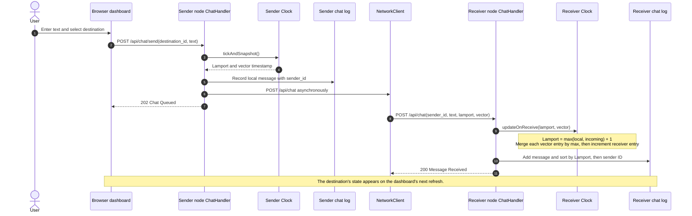

# UML Sequence Diagrams

These Mermaid sequence diagrams describe the current implementation. They can be rendered in Markdown viewers that support Mermaid or copied into the project report.

## Chat send and logical clock merge

The GUI sends through the node that serves the page. That node ticks its local clocks and records the outgoing message, then asynchronously posts it to the selected destination. The HTTP `202` acknowledges that the message was queued; it does not wait for the destination's receive handler to finish.



## Token-ring scoreboard update

Score requests are queued locally, either through the terminal command or the dashboard's `POST /api/score`. The node applies its pending deltas only when it receives the circulating token. Each successful hand-off carries the token ID, a higher sequence number, and the latest score snapshot.

```mermaid
sequenceDiagram
    autonumber
    actor User
    participant UI as Dashboard or console
    participant A as Node A current token holder
    participant MA as Node A MutualExclusion
    participant B as Node B ChatHandler / console
    participant MB as Node B MutualExclusion
    participant SB as Node B Scoreboard
    participant Sched as Node B scheduler
    participant NetB as Node B NetworkClient
    participant C as Next active node

    Note over MA: Node 0 initializes with the token; begin() starts circulation after its server starts.<br/>Other nodes' begin() calls do nothing until they receive the token.
    User->>UI: score player delta (Node B)
    alt Dashboard entry
        UI->>B: POST /api/score(player, delta)
        B->>MB: requestCriticalSection(player, delta)
        B-->>UI: 202 Score Queued
    else Terminal entry
        User->>MB: requestCriticalSection(player, delta)
    end

    A->>B: POST /api/token(token_id, sequence=n, scores)
    B->>MB: receiveToken(token_id, n, scores)
    MB->>MB: Validate token ID and reject stale or duplicate sequence
    MB->>SB: Replace local scoreboard with transferred snapshot
    alt Node B has queued score deltas
        MB->>SB: Apply queued deltas inside synchronized receive path
    else No queued updates
        MB->>MB: No score change; continue circulating token
    end
    MB->>Sched: Increment sequence to n+1 and schedule hand-off after configured delay
    B-->>A: 200 Token Handled
    A->>MA: Clear local token ownership after acknowledgement
    Sched->>NetB: POST /api/token after configured delay
    NetB->>C: POST /api/token(token_id, sequence=n+1, updated scores)

    loop Continue around active ring nodes
        C->>C: Receive token, apply local queued updates, then forward to next active peer
    end

    opt Next node is unavailable
        NetB--xC: Connection to next node fails
        B->>B: Advance to next configured peer; retry after one second
        B->>Sched: Schedule next hand-off after configured delay
        Sched->>NetB: POST /api/token
        NetB->>C: Retry to next reachable node
    end
```

## Bully leader election after coordinator failure

This shows Node 7 detecting that its known coordinator, Node 9, is unavailable. Node 8 is the highest reachable node, so it becomes coordinator and announces itself to the active peers.

```mermaid
sequenceDiagram
    autonumber
    participant N7 as Node 7
    participant H9 as Node 9 health endpoint
    participant N8 as Node 8
    participant N9 as Node 9
    participant Peers as Nodes 0-6 (active)

    loop Leader probes
        N7->>H9: GET /api/health
        H9--xN7: No response / connection failure
    end
    N7->>N7: probeLeader() starts election
    N7->>N8: POST /api/election {type: ELECTION, sender_id: 7}
    N7->>N9: POST /api/election {type: ELECTION, sender_id: 7}
    N9--xN7: Request fails; Node 9 is down
    N8->>N7: POST /api/election {type: OK, sender_id: 8}
    N8->>N8: Start own election
    N8->>N9: POST /api/election {type: ELECTION, sender_id: 8}
    N9--xN8: Request fails; no higher node responds
    N8->>N8: Election timeout; declare Node 8 coordinator
    N8->>Peers: Broadcast COORDINATOR to Nodes 0-6
    N8->>N7: POST /api/election {type: COORDINATOR, sender_id: 8}
    N8->>N9: POST /api/election {type: COORDINATOR, sender_id: 8}
    N9--xN8: Broadcast request fails; Node 9 is down
    Peers-->>N8: Acknowledge reachable coordinator messages
    N7->>N7: Store Node 8 as current coordinator
```

## Token-holder crash recovery

This additional diagram covers the implementation's recovery extension: after a holder crashes, the newly elected coordinator scans reachable `/api/state` endpoints. It restores the token only after two scans find no live holder, the reachable nodes agree on the coordinator, and one token ID and a usable score snapshot are available.

```mermaid
sequenceDiagram
    autonumber
    participant Holder as Failed token holder
    participant Coord as Newly elected coordinator
    participant Peers as Reachable nodes
    participant M as Coordinator MutualExclusion
    participant Next as Next ring node

    Holder--xPeers: Process stops while holding token
    Note over Coord: Bully election completes; coordinator-only recovery scan runs periodically.
    Coord->>Peers: GET /api/state
    Peers-->>Coord: has_token=false, leader_id, token_id, sequence, scores
    Coord->>M: Inspect first complete scan
    Note over M: No recovery yet; require a second consecutive scan with no owner.
    Coord->>Peers: GET /api/state (next scan)
    Peers-->>Coord: Same leader; no live token holder; consistent token ID
    Coord->>M: Inspect second scan and select freshest reachable score snapshot
    M->>M: Restore token; advance local sequence watermark; apply queued local deltas
    M->>Next: Forward same token ID at a higher sequence number
    Next-->>M: Token Handled acknowledgement
    Note over Coord,Next: Unreachable peers are ignored during scans and skipped during forwarding.<br/>A network partition can appear to be a crash.
```
